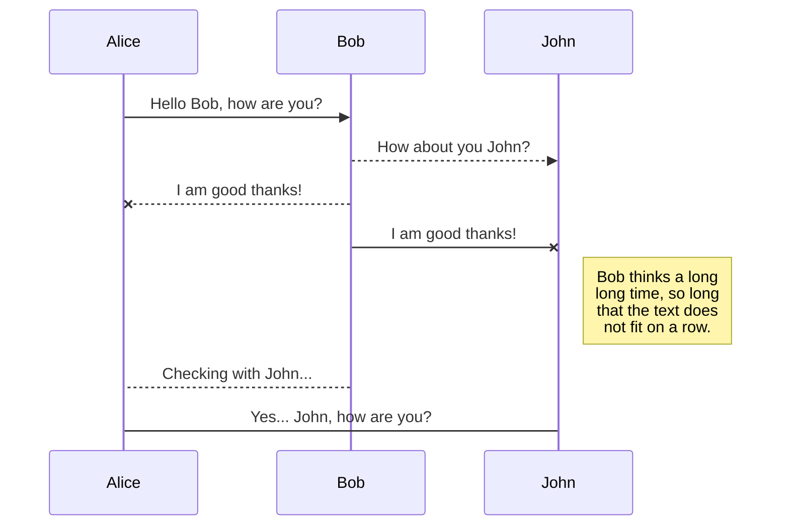
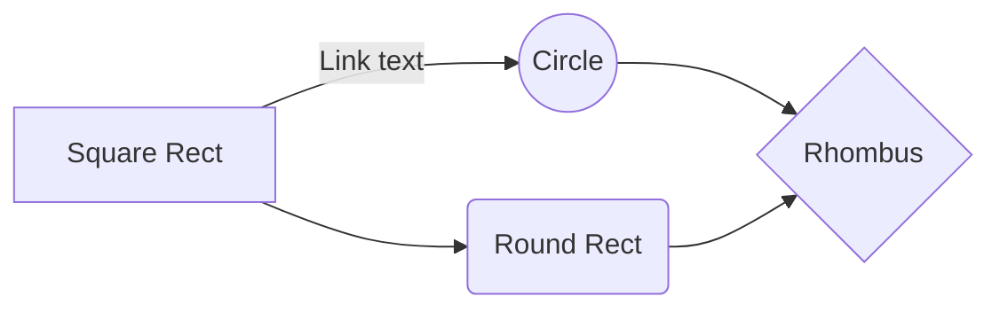

import { Button } from '@/components/Button';
import { Chart } from '@/components/Chart';

# Welcome to `welcome.mdx`

# MDX 기본 문법 가이드

## 1. 기본 마크다운 문법

일반 텍스트와 **굵은 글씨**, _기울임체_, ~~취소선~~, <ins>밑줄</ins> 을 사용할 수 있습니다.

### 목록

- 순서 없는 목록
- 두 번째 항목
  - 중첩된 항목

1. 순서 있는 목록
2. 두 번째 항목

### 인용문

> MDX는 마크다운과 JSX의 강력한 조합입니다.
> 여러 줄의 인용문도 가능합니다.
>
> > 중첩된 인용문도 가능합니다.

### 코드 블록

```
# plain text
1. title
2. caption
```

```plaintext
# plain text
1. title
2. caption
```

```javascript
const greeting = 'Hello, MDX!';
console.log(greeting);
```

```typescript
const greeting: string = 'Hello, MDX!';
console.log(greeting);
```

```python
def hello():
    print("Hello, MDX!")
```

```bash
$ npm install
```

```html
<div>Hello, MDX!</div>
```

```css
body {
  background-color: #f0f0f0;
}
```

```java
public class HelloMDX {
    public static void main(String[] args) {
        System.out.println("Hello, MDX!");
    }
}
```

인라인 코드는 `이렇게` 작성합니다.

### 표

| 제목 | 설명           |
| ---- | -------------- |
| MDX  | Markdown + JSX |
| JSX  | JavaScript XML |

### 링크와 이미지

[MDX 공식 문서](https://mdxjs.com)


## 2. JSX와 컴포넌트 사용

아래는 버튼 컴포넌트 예시입니다:

<div className="button-example">
  <Button>클릭하세요</Button>
</div>

아래는 차트 컴포넌트 예시입니다:

<div className="chart-example">
  <Chart data={[1, 2, 3, 4, 5]} title="샘플 차트" />
</div>

## 3. JSX 표현식

<div className="expression-example">{3 + 5}</div>

<div className="list-example">
  <ul>
    {['Apple', 'Banana', 'Orange'].map(fruit => (
      <li key={fruit}>{fruit}</li>
    ))}
  </ul>
</div>

## 4. 스타일링

<div style={{ color: 'blue', padding: '20px' }}>스타일이 적용된 div입니다.</div>

## 5. HTML 직접 사용

<div className="details-example">
  <details>
    <summary>더 보기</summary>
    <div>숨겨진 내용입니다.</div>
  </details>
</div>

## 6. 프론트매터 사용

페이지 상단의 --- 로 둘러싸인 영역에 메타데이터를 정의할 수 있습니다.

## 7. 익스포트 사용

export const MyComponent = () => <span>커스텀 컴포넌트</span>;

<MyComponent />

# Synchronization

Synchronization is one of the biggest features of StackEdit. It enables you to synchronize any file in your workspace with other files stored in your **Google Drive**, your **Dropbox** and your **GitHub** accounts. This allows you to keep writing on other devices, collaborate with people you share the file with, integrate easily into your workflow... The synchronization mechanism takes place every minute in the background, downloading, merging, and uploading file modifications.

There are two types of synchronization and they can complement each other:

- The workspace synchronization will sync all your files, folders and settings automatically. This will allow you to fetch your workspace on any other device.

  > To start syncing your workspace, just sign in with Google in the menu.

- The file synchronization will keep one file of the workspace synced with one or multiple files in **Google Drive**, **Dropbox** or **GitHub**.
  > Before starting to sync files, you must link an account in the **Synchronize** sub-menu.

## Open a file

You can open a file from **Google Drive**, **Dropbox** or **GitHub** by opening the **Synchronize** sub-menu and clicking **Open from**. Once opened in the workspace, any modification in the file will be automatically synced.

## Save a file

You can save any file of the workspace to **Google Drive**, **Dropbox** or **GitHub** by opening the **Synchronize** sub-menu and clicking **Save on**. Even if a file in the workspace is already synced, you can save it to another location. StackEdit can sync one file with multiple locations and accounts.

## Synchronize a file

Once your file is linked to a synchronized location, StackEdit will periodically synchronize it by downloading/uploading any modification. A merge will be performed if necessary and conflicts will be resolved.

If you just have modified your file and you want to force syncing, click the **Synchronize now** button in the navigation bar.

> **Note:** The **Synchronize now** button is disabled if you have no file to synchronize.

## Manage file synchronization

Since one file can be synced with multiple locations, you can list and manage synchronized locations by clicking **File synchronization** in the **Synchronize** sub-menu. This allows you to list and remove synchronized locations that are linked to your file.

# Publication

Publishing in StackEdit makes it simple for you to publish online your files. Once you're happy with a file, you can publish it to different hosting platforms like **Blogger**, **Dropbox**, **Gist**, **GitHub**, **Google Drive**, **WordPress** and **Zendesk**. With [Handlebars templates](http://handlebarsjs.com/), you have full control over what you export.

> Before starting to publish, you must link an account in the **Publish** sub-menu.

## Publish a File

You can publish your file by opening the **Publish** sub-menu and by clicking **Publish to**. For some locations, you can choose between the following formats:

- Markdown: publish the Markdown text on a website that can interpret it (**GitHub** for instance),
- HTML: publish the file converted to HTML via a Handlebars template (on a blog for example).

## Update a publication

After publishing, StackEdit keeps your file linked to that publication which makes it easy for you to re-publish it. Once you have modified your file and you want to update your publication, click on the **Publish now** button in the navigation bar.

> **Note:** The **Publish now** button is disabled if your file has not been published yet.

## Manage file publication

Since one file can be published to multiple locations, you can list and manage publish locations by clicking **File publication** in the **Publish** sub-menu. This allows you to list and remove publication locations that are linked to your file.

# Markdown extensions

StackEdit extends the standard Markdown syntax by adding extra **Markdown extensions**, providing you with some nice features.

> **ProTip:** You can disable any **Markdown extension** in the **File properties** dialog.

## SmartyPants

SmartyPants converts ASCII punctuation characters into "smart" typographic punctuation HTML entities. For example:

|                  | ASCII                           | HTML                          |
| ---------------- | ------------------------------- | ----------------------------- |
| Single backticks | `'Isn't this fun?'`             | 'Isn't this fun?'             |
| Quotes           | `"Isn't this fun?"`             | "Isn't this fun?"             |
| Dashes           | `-- is en-dash, --- is em-dash` | -- is en-dash, --- is em-dash |

## KaTeX

You can render LaTeX mathematical expressions using [KaTeX](https://khan.github.io/KaTeX/):

The _Gamma function_ satisfying $\Gamma(n) = (n-1)!\quad\forall n\in\mathbb N$ is via the Euler integral

$$
\Gamma(z) = \int_0^\infty t^{z-1}e^{-t}dt\,.
$$

> You can find more information about **LaTeX** mathematical expressions [here](http://meta.math.stackexchange.com/questions/5020/mathjax-basic-tutorial-and-quick-reference).

## UML diagrams

You can render UML diagrams using [Mermaid](https://mermaidjs.github.io/). For example, this will produce a sequence diagram:



And this will produce a flow chart:


