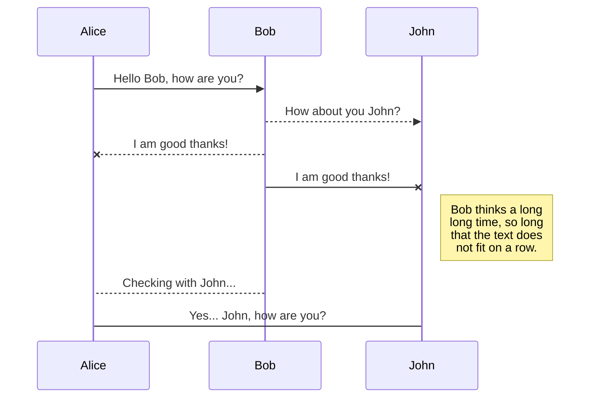
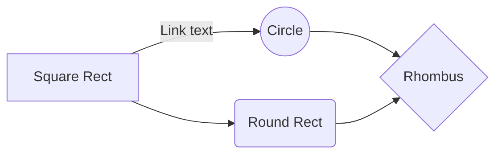

import { Button } from '@/components/Button';
import { Chart } from '@/components/Chart';

# MDX 기본 문법 가이드

## 1. 기본 마크다운 문법

일반 텍스트와 **굵은 글씨**, _기울임체_, ~~취소선~~, <ins>밑줄</ins> 을 사용할 수 있습니다.

### 목록

- 순서 없는 목록
- 두 번째 항목
    - 중첩된 항목
        - 중첩된 항목

1. 순서 있는 목록
    1. 중첩된 항목
        1. 중첩된 항목
        2. 중첩된 항목
        3. 중첩된 항목
    2. 중첩된 항목
2. 두 번째 항목

### 인용문

> MDX는 마크다운과 JSX의 강력한 조합입니다.
> 여러 줄의 인용문도 가능합니다.
>
> > 중첩된 인용문도 가능합니다.

### 코드 블록

```
# plain text
1. title
2. caption
```

```plaintext
# plain text
1. title
2. caption
```

```javascript
const greeting = 'Hello, MDX!';
console.log(greeting);
```

```typescript
const greeting: string = 'Hello, MDX!';
console.log(greeting);
```

```python
def hello():
    print("Hello, MDX!")
```

```bash
$ npm install
```

```html
<div>Hello, MDX!</div>
```

```css
body {
  background-color: #f0f0f0;
}
```

```java
public class HelloMDX {
    public static void main(String[] args) {
        System.out.println("Hello, MDX!");
    }
}
```

인라인 코드는 `이렇게` 작성합니다.

### 표

| 제목 | 설명           |
| ---- | -------------- |
| MDX  | Markdown + JSX |
| JSX  | JavaScript XML |

### 링크와 이미지

[MDX 공식 문서](https://mdxjs.com)


## 2. JSX와 컴포넌트 사용

아래는 버튼 컴포넌트 예시입니다:

<div className="button-example">
  <Button>클릭하세요</Button>
</div>

아래는 차트 컴포넌트 예시입니다:

<div className="chart-example">
  <Chart data={[1, 2, 3, 4, 5]} title="샘플 차트" />
</div>

## 3. JSX 표현식

### 3.1 수식
<div className="expression-example">{`3 + 5 = ${3 + 5}`}</div>

### 3.2 목록
<div className="list-example">
  <ul>
    {['Apple', 'Banana', 'Orange'].map(fruit => (
      <li key={fruit}>{fruit}</li>
    ))}
  </ul>
</div>

## 4. 스타일링

<div style={{ color: 'blue', padding: '20px' }}>스타일이 적용된 div입니다.</div>

## 5. HTML 직접 사용

<div className="details-example">
  <details>
    <summary>더 보기</summary>
    <div>숨겨진 내용입니다.</div>
  </details>
</div>

## 6. 프론트매터 사용

페이지 상단의 --- 로 둘러싸인 영역에 메타데이터를 정의할 수 있습니다.

## 7. 익스포트 사용

export const MyComponent = () => <span>커스텀 컴포넌트</span>;

<MyComponent />


## 8. KaTeX

You can render LaTeX mathematical expressions using [KaTeX](https://khan.github.io/KaTeX/):

The _Gamma function_ satisfying $\Gamma(n) = (n-1)!\quad\forall n\in\mathbb N$ is via the Euler integral

$$
\Gamma(z) = \int_0^\infty t^{z-1}e^{-t}dt\,.
$$

> You can find more information about **LaTeX** mathematical expressions [here](http://meta.math.stackexchange.com/questions/5020/mathjax-basic-tutorial-and-quick-reference).

## 9. UML diagrams

You can render UML diagrams using [Mermaid](https://mermaidjs.github.io/). For example, this will produce a sequence diagram:



And this will produce a flow chart:


